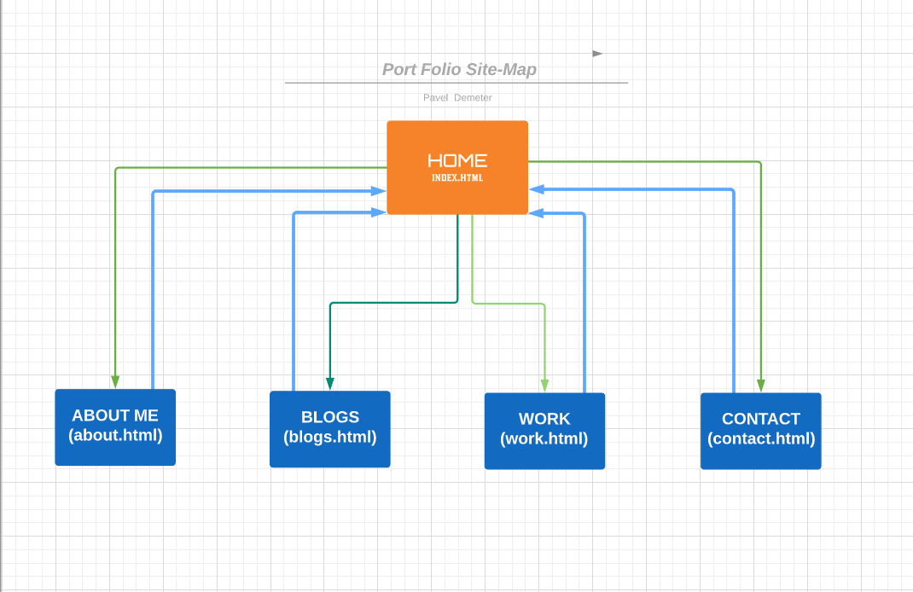
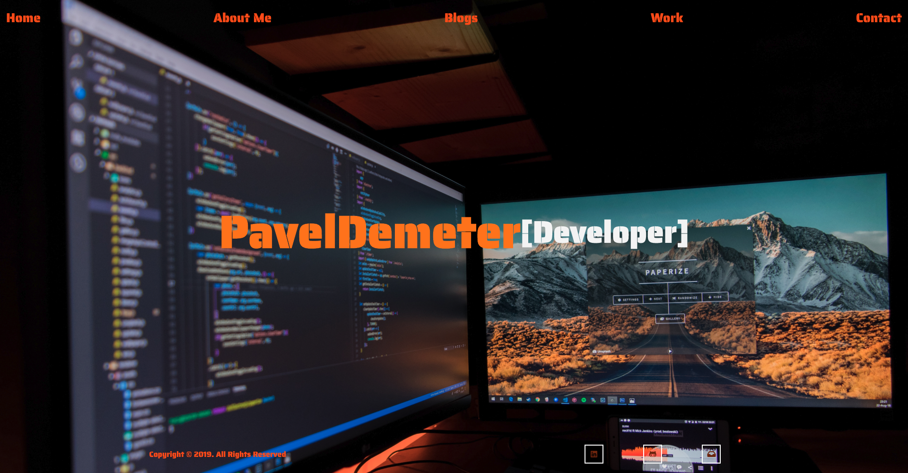
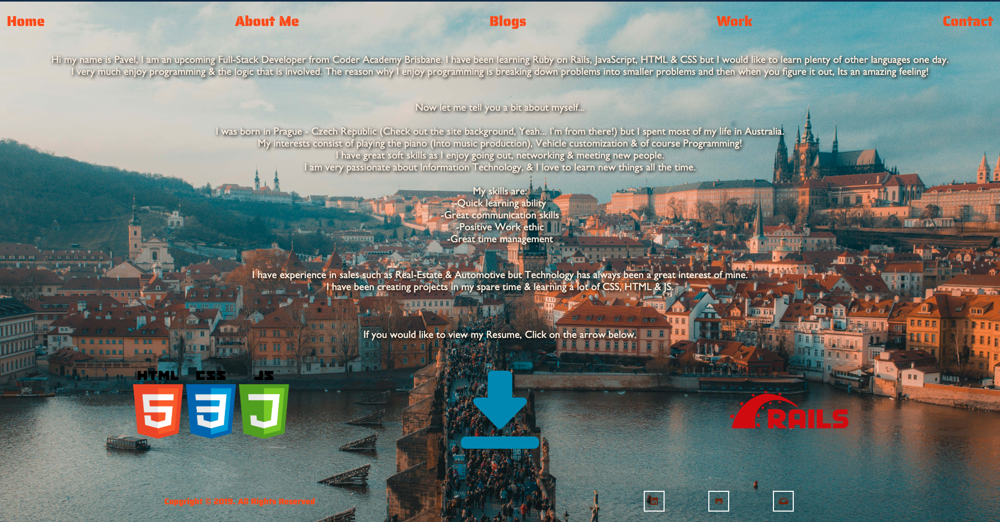
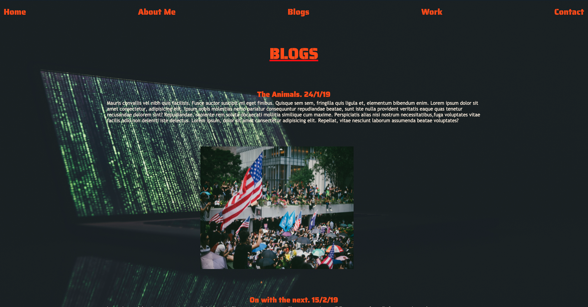
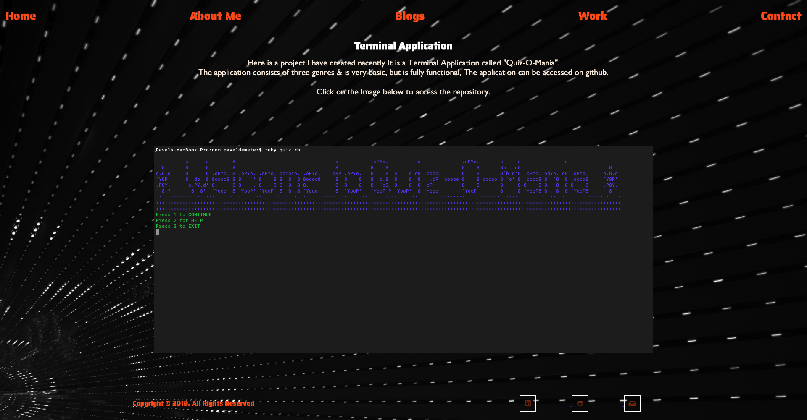
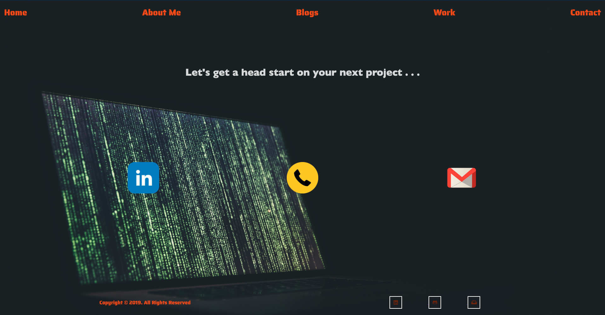

# Pavel Demeter - Port Folio

Hi! Welcome to my read-me about my Portfolio, Below you will find all the information about my port-folio website.
## Link to Repository
GITHUB Repository 
https://github.com/paveldemeter/portfolio
## Link to URL

Published portfolio Website
https://paveldemeter.github.io/portfolio/index.html

# Purpose

The primary purpose of developing this website was to show what I had learnt about CSS & HTML & how I can utilise those languages. Secondly, to display my interests, skills & work history to potential employers and other people of interest. 

## Functionality / Features

The website was developed to be as simple as possible to navigate easily & obtain all the information required. 
My opinion is sometimes simple is better, Easier to view & understand. The design of this website was based upon a wire-frame I drew up, I later decided to implement a bit more animation than I anticipated but I still wanted to continue with the simplicity. Throughout the site you have clickable links from images or icons to open various resources such as linkedin , Github & way to contact me. The email will automatically open up Outlook(Or any mail app) on any device so its easier to contact me, The phone icon will open up Face-time or you can simple copy the number and call me. (depending on your OS).

## Site Map

Here I have attached the main diagram of my site-map. easily navigated.

## Screen shots

Here I have attached screen shots of my website, easily to view the whole website throughout.

## Target Audience

This projects target audience was anybody who was interested in me and what I do, but to be more specific it was aimed at future employers & developers who wanted to learn about me. The project contains information about me such as skills, a little bit about me & my projects. Realistically the website is for anybody who wants to interact with me as friends or potential networkers.

## Tech Stack

The foundation of my website was HTML5 & CSS. Although CSS was compiled from SCSS (much more efficient I must say). In the future I would like to use Ruby on Rails as my back-end as that is what we will be learning next on Coder-Academy.

